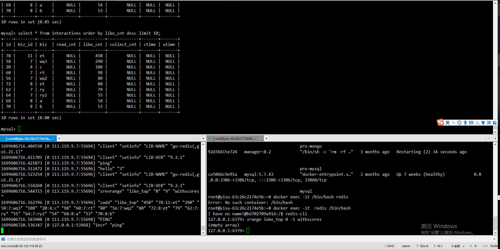
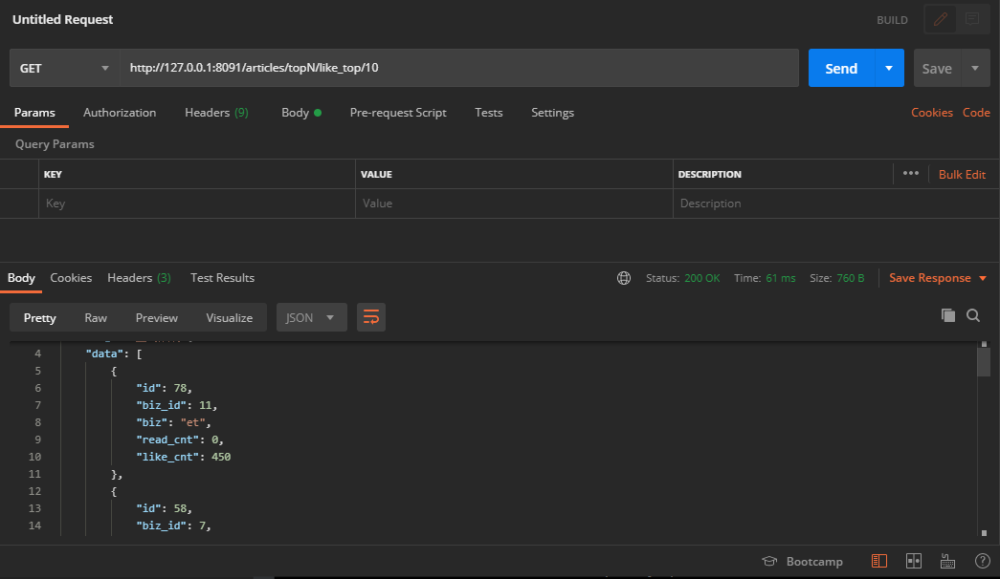
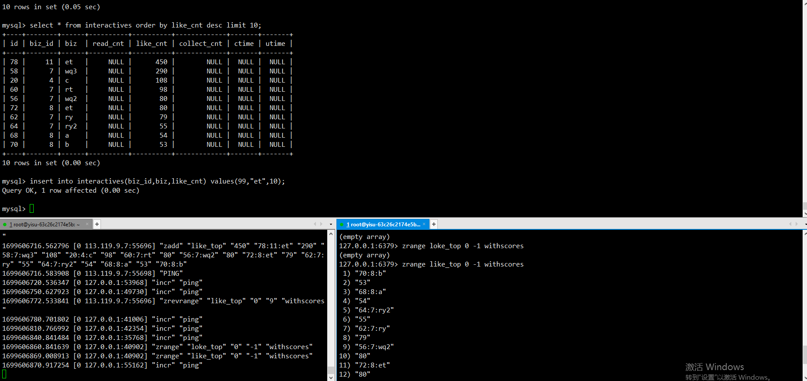
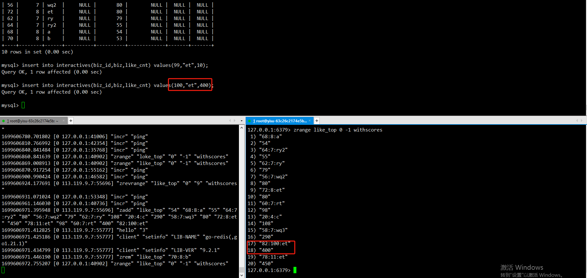
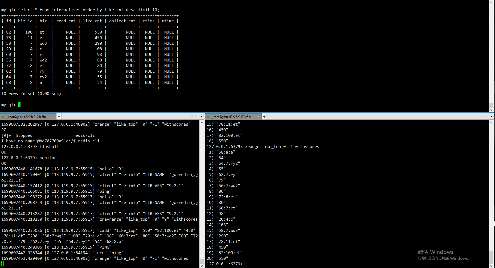

```text
1.使用cancel 读取 mysql 中webook.interactives 表 的binlog 日志,将产生的数据放到kafka 中
2.webook 服务 中加一个cancel 的consumer
3.该consumer 启动的时候先从数据库中 获取topN 的数据 然后存到redis 中，并在本地使用map 记录topN 的数据 以及使用小顶堆进行排序
4.该concumer 读取kafka 中的事件,先判断 
   1.对应的对象是否在map 中，如果在就更新对应的点赞数等,再依据map 来生成小顶堆,再继续走4.2
   2.对象不再map 中,跟小顶堆的第一个元素比较 如果比第一个元素大就删除小顶堆的第一个数据,再把新事件的对象放到小顶堆中
   3.根据4.1 4.2 的情况按需更新redis 中的zset ，4.2中如果要删除元素 redis 中也要删除zset 中对应的元素
5.查询可以直接从redis 中获取也行,(优化点:如果需要可以加一个本地缓存(多节点的情况下 可以使用redis 的订阅功能进行数据同步))

缺点: 
    1.consumer 批量处理 cancel消息的时候进行去重(可以减少数据的传输),cancel 的数据具有可重入的特性
    2.如果TopN N数据过大的情况下 4.1步骤比较吃性能
优点:
    1.整个流程只需要在启动的时候操作一次mysql,如果建立本地缓存+redis 订阅功能  可以不通过mysql 就可以获取到topN的数据  


```


## 测试

```bash
cancel 、 mysql 、 redis 、 kafka 容器启动
webook 服务启动

用于监控测试数据


1.使用接口查询

{"code":200,"msg":"查询成功","data":[{"id":78,"biz_id":11,"biz":"et","read_cnt":0,"like_cnt":450},{"id":58,"biz_id":7,"biz":"wq3","read_cnt":0,"like_cnt":290},{"id":20,"biz_id":4,"biz":"c","read_cnt":0,"like_cnt":108},{"id":60,"biz_id":7,"biz":"rt","read_cnt":0,"like_cnt":98},{"id":72,"biz_id":8,"biz":"et","read_cnt":0,"like_cnt":80},{"id":56,"biz_id":7,"biz":"wq2","read_cnt":0,"like_cnt":80},{"id":62,"biz_id":7,"biz":"ry","read_cnt":0,"like_cnt":79},{"id":64,"biz_id":7,"biz":"ry2","read_cnt":0,"like_cnt":55},{"id":68,"biz_id":8,"biz":"a","read_cnt":0,"like_cnt":54},{"id":70,"biz_id":8,"biz":"b","read_cnt":0,"like_cnt":53}]}
2.插入一条 非topN 的数据

使用查询接口
{"code":200,"msg":"查询成功","data":[{"id":78,"biz_id":11,"biz":"et","read_cnt":0,"like_cnt":450},{"id":58,"biz_id":7,"biz":"wq3","read_cnt":0,"like_cnt":290},{"id":20,"biz_id":4,"biz":"c","read_cnt":0,"like_cnt":108},{"id":60,"biz_id":7,"biz":"rt","read_cnt":0,"like_cnt":98},{"id":72,"biz_id":8,"biz":"et","read_cnt":0,"like_cnt":80},{"id":56,"biz_id":7,"biz":"wq2","read_cnt":0,"like_cnt":80},{"id":62,"biz_id":7,"biz":"ry","read_cnt":0,"like_cnt":79},{"id":64,"biz_id":7,"biz":"ry2","read_cnt":0,"like_cnt":55},{"id":68,"biz_id":8,"biz":"a","read_cnt":0,"like_cnt":54},{"id":70,"biz_id":8,"biz":"b","read_cnt":0,"like_cnt":53}]}

结论:排名不变

3.插入一条 topN 的数据

使用查询接口
{"code":200,"msg":"查询成功","data":[{"id":78,"biz_id":11,"biz":"et","read_cnt":0,"like_cnt":450},{"id":82,"biz_id":100,"biz":"et","read_cnt":0,"like_cnt":400},{"id":58,"biz_id":7,"biz":"wq3","read_cnt":0,"like_cnt":290},{"id":20,"biz_id":4,"biz":"c","read_cnt":0,"like_cnt":108},{"id":60,"biz_id":7,"biz":"rt","read_cnt":0,"like_cnt":98},{"id":72,"biz_id":8,"biz":"et","read_cnt":0,"like_cnt":80},{"id":56,"biz_id":7,"biz":"wq2","read_cnt":0,"like_cnt":80},{"id":62,"biz_id":7,"biz":"ry","read_cnt":0,"like_cnt":79},{"id":64,"biz_id":7,"biz":"ry2","read_cnt":0,"like_cnt":55},{"id":68,"biz_id":8,"biz":"a","read_cnt":0,"like_cnt":54}]}

结论:原来第10的数据踢掉了, 新增了一个数据

4.更新一条 topN 的数据



使用查询接口
{"code":200,"msg":"查询成功","data":[{"id":78,"biz_id":11,"biz":"et","read_cnt":0,"like_cnt":650},{"id":82,"biz_id":100,"biz":"et","read_cnt":0,"like_cnt":550},{"id":58,"biz_id":7,"biz":"wq3","read_cnt":0,"like_cnt":290},{"id":20,"biz_id":4,"biz":"c","read_cnt":0,"like_cnt":108},{"id":60,"biz_id":7,"biz":"rt","read_cnt":0,"like_cnt":98},{"id":72,"biz_id":8,"biz":"et","read_cnt":0,"like_cnt":80},{"id":56,"biz_id":7,"biz":"wq2","read_cnt":0,"like_cnt":80},{"id":62,"biz_id":7,"biz":"ry","read_cnt":0,"like_cnt":79},{"id":64,"biz_id":7,"biz":"ry2","read_cnt":0,"like_cnt":55},{"id":68,"biz_id":8,"biz":"a","read_cnt":0,"like_cnt":54}]}

结论:topN 还是原来的topN  顺序变了

```
