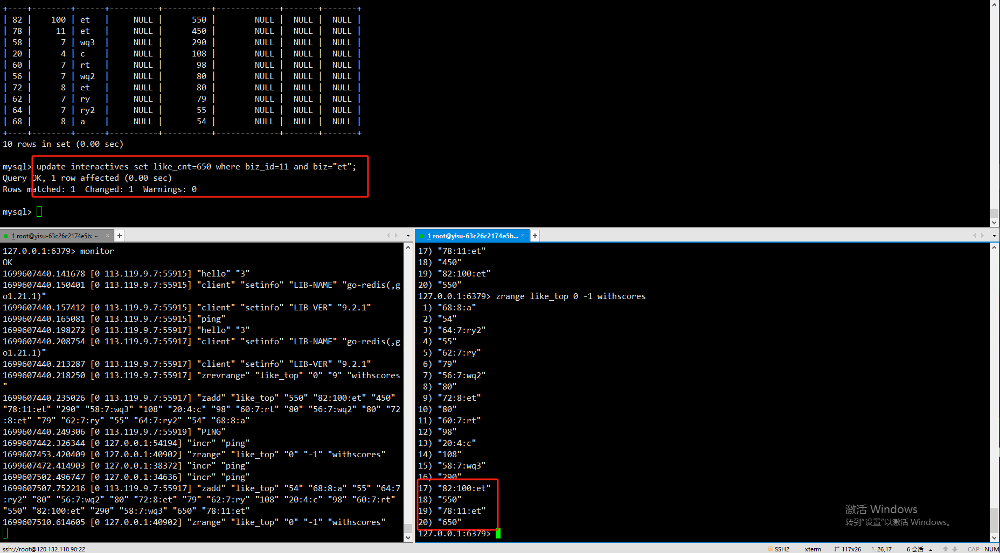

```text
1.使用cancel 读取 mysql 中webook.interactives 表 的binlog 日志,将产生的数据放到kafka 中
2.webook 服务 中加一个cancel 的consumer
3.该consumer 启动的时候先从数据库中 获取topN 的数据 然后存到redis 中，并在本地使用map 记录topN 的数据 以及使用小顶堆进行排序
4.该concumer 读取kafka 中的事件,先判断 
   1.对应的对象是否在map 中，如果在就更新对应的点赞数等,再依据map 来生成小顶堆,再继续走4.2
   2.对象不再map 中,跟小顶堆的第一个元素比较 如果比第一个元素大就删除小顶堆的第一个数据,再把新事件的对象放到小顶堆中
   3.根据4.1 4.2 的情况按需更新redis 中的zset ，4.2中如果要删除元素 redis 中也要删除zset 中对应的元素
5.查询可以直接从redis 中获取也行,(优化点:如果需要可以加一个本地缓存(多节点的情况下 可以使用redis 的订阅功能进行数据同步))

缺点: 
    1.consumer 批量处理 cancel消息的时候进行去重(可以减少数据的传输),cancel 的数据具有可重入的特性
    2.如果TopN N数据过大的情况下 4.1步骤比较吃性能
优点:
    1.整个流程只需要在启动的时候操作一次mysql,如果建立本地缓存+redis 订阅功能  可以不通过mysql 就可以获取到topN的数据  


```


## 测试

```bash
cancel 、 mysql 、 redis 、 kafka 容器启动
webook 服务启动
```
用于监控测试数据


1.使用接口查询

{"code":200,"msg":"查询成功","data":[{"id":78,"biz_id":11,"biz":"et","read_cnt":0,"like_cnt":450},{"id":58,"biz_id":7,"biz":"wq3","read_cnt":0,"like_cnt":290},{"id":20,"biz_id":4,"biz":"c","read_cnt":0,"like_cnt":108},{"id":60,"biz_id":7,"biz":"rt","read_cnt":0,"like_cnt":98},{"id":72,"biz_id":8,"biz":"et","read_cnt":0,"like_cnt":80},{"id":56,"biz_id":7,"biz":"wq2","read_cnt":0,"like_cnt":80},{"id":62,"biz_id":7,"biz":"ry","read_cnt":0,"like_cnt":79},{"id":64,"biz_id":7,"biz":"ry2","read_cnt":0,"like_cnt":55},{"id":68,"biz_id":8,"biz":"a","read_cnt":0,"like_cnt":54},{"id":70,"biz_id":8,"biz":"b","read_cnt":0,"like_cnt":53}]}

2.插入一条 非topN 的数据

使用查询接口
{"code":200,"msg":"查询成功","data":[{"id":78,"biz_id":11,"biz":"et","read_cnt":0,"like_cnt":450},{"id":58,"biz_id":7,"biz":"wq3","read_cnt":0,"like_cnt":290},{"id":20,"biz_id":4,"biz":"c","read_cnt":0,"like_cnt":108},{"id":60,"biz_id":7,"biz":"rt","read_cnt":0,"like_cnt":98},{"id":72,"biz_id":8,"biz":"et","read_cnt":0,"like_cnt":80},{"id":56,"biz_id":7,"biz":"wq2","read_cnt":0,"like_cnt":80},{"id":62,"biz_id":7,"biz":"ry","read_cnt":0,"like_cnt":79},{"id":64,"biz_id":7,"biz":"ry2","read_cnt":0,"like_cnt":55},{"id":68,"biz_id":8,"biz":"a","read_cnt":0,"like_cnt":54},{"id":70,"biz_id":8,"biz":"b","read_cnt":0,"like_cnt":53}]}

结论:排名不变

3.插入一条 topN 的数据

使用查询接口
{"code":200,"msg":"查询成功","data":[{"id":78,"biz_id":11,"biz":"et","read_cnt":0,"like_cnt":450},{"id":82,"biz_id":100,"biz":"et","read_cnt":0,"like_cnt":400},{"id":58,"biz_id":7,"biz":"wq3","read_cnt":0,"like_cnt":290},{"id":20,"biz_id":4,"biz":"c","read_cnt":0,"like_cnt":108},{"id":60,"biz_id":7,"biz":"rt","read_cnt":0,"like_cnt":98},{"id":72,"biz_id":8,"biz":"et","read_cnt":0,"like_cnt":80},{"id":56,"biz_id":7,"biz":"wq2","read_cnt":0,"like_cnt":80},{"id":62,"biz_id":7,"biz":"ry","read_cnt":0,"like_cnt":79},{"id":64,"biz_id":7,"biz":"ry2","read_cnt":0,"like_cnt":55},{"id":68,"biz_id":8,"biz":"a","read_cnt":0,"like_cnt":54}]}

结论:原来第10的数据踢掉了, 新增了一个数据

4.更新一条 topN 的数据




使用查询接口
{"code":200,"msg":"查询成功","data":[{"id":78,"biz_id":11,"biz":"et","read_cnt":0,"like_cnt":650},{"id":82,"biz_id":100,"biz":"et","read_cnt":0,"like_cnt":550},{"id":58,"biz_id":7,"biz":"wq3","read_cnt":0,"like_cnt":290},{"id":20,"biz_id":4,"biz":"c","read_cnt":0,"like_cnt":108},{"id":60,"biz_id":7,"biz":"rt","read_cnt":0,"like_cnt":98},{"id":72,"biz_id":8,"biz":"et","read_cnt":0,"like_cnt":80},{"id":56,"biz_id":7,"biz":"wq2","read_cnt":0,"like_cnt":80},{"id":62,"biz_id":7,"biz":"ry","read_cnt":0,"like_cnt":79},{"id":64,"biz_id":7,"biz":"ry2","read_cnt":0,"like_cnt":55},{"id":68,"biz_id":8,"biz":"a","read_cnt":0,"like_cnt":54}]}

结论:topN 还是原来的topN  顺序变了


```bash
#kafka
root@yisu-63c26c2174e5b:~# cat kafka-compose.yaml 
version: '3.0'
services:
  kafka:
    image: 'bitnami/kafka:3.6.0'
    ports:
      - '9092:9092'
      - '9094:9094'
    environment:
      - KAFKA_CFG_NODE_ID=0
#      - 允许自动创建 topic，线上不要开启
      - KAFKA_CFG_AUTO_CREATE_TOPICS_ENABLE=true
      - KAFKA_CFG_PROCESS_ROLES=controller,broker
        #KAFKA_LISTENERS：负责绑定网卡
      - ALLOW_PLAINTEXT_LISTENER=yes
        #KAFKA_ADVERTISED_LISTENERS：负责发布外网地址，这个地址会发布到zookeeper中
      - KAFKA_CFG_LISTENERS=PLAINTEXT://0.0.0.0:9092,CONTROLLER://:9093,EXTERNAL://0.0.0.0:9094
      - KAFKA_CFG_ADVERTISED_LISTENERS=PLAINTEXT://kafka:9092,EXTERNAL://外网地址:9094
      - KAFKA_CFG_LISTENER_SECURITY_PROTOCOL_MAP=CONTROLLER:PLAINTEXT,EXTERNAL:PLAINTEXT,PLAINTEXT:PLAINTEXT
      - KAFKA_CFG_CONTROLLER_QUORUM_VOTERS=0@kafka:9093
      - KAFKA_CFG_CONTROLLER_LISTENER_NAMES=CONTROLLER


#cancal
root@master: docker run --name canal -p 11111:11111 -d -v /home/canal/instance.properties:/home/admin/canal-server/conf/example/instance.properties -v /home/canal/canal.properties:/home/admin/canal-server/conf/canal.properties canal/canal-server
root@master:/home/canal# ls
canal.properties  instance.properties

[root@yisu-62b2ab8b7ea9a canal]# vi conf/canal.properties

#kafka配置

#################################################
#########     common argument    #############
#################################################
# tcp bind ip
# 用户go 等客户端连接的ip
canal.ip = 156.236.71.5
# register ip to zookeeper
canal.register.ip = 156.236.71.5
# 用户go 等客户端连接的端口
canal.port = 11111
canal.metrics.pull.port = 11112
# canal instance user/passwd
# canal.user = canal
# canal.passwd = E3619321C1A937C46A0D8BD1DAC39F93B27D4458

# canal admin config
#canal.admin.manager = 127.0.0.1:8089
canal.admin.port = 11110
canal.admin.user = admin
canal.admin.passwd = 4ACFE3202A5FF5CF467898FC58AAB1D615029441
# admin auto register
#canal.admin.register.auto = true
#canal.admin.register.cluster =
#canal.admin.register.name =

canal.zkServers =
# flush data to zk
canal.zookeeper.flush.period = 1000
canal.withoutNetty = false
# tcp, kafka, rocketMQ, rabbitMQ
# 连接方式 tcp  使用go代码作为消费者  kafka 使用kafka作为消费者(go 代码就连不上)
canal.serverMode = kafka
# flush meta cursor/parse position to file
canal.file.data.dir = ${canal.conf.dir}
canal.file.flush.period = 1000
## memory store RingBuffer size, should be Math.pow(2,n)
canal.instance.memory.buffer.size = 16384
## memory store RingBuffer used memory unit size , default 1kb
canal.instance.memory.buffer.memunit = 1024 
## meory store gets mode used MEMSIZE or ITEMSIZE
canal.instance.memory.batch.mode = MEMSIZE
canal.instance.memory.rawEntry = true

## detecing config
canal.instance.detecting.enable = false
#canal.instance.detecting.sql = insert into retl.xdual values(1,now()) on duplicate key update x=now()
canal.instance.detecting.sql = select 1
canal.instance.detecting.interval.time = 3
canal.instance.detecting.retry.threshold = 3
canal.instance.detecting.heartbeatHaEnable = false

# support maximum transaction size, more than the size of the transaction will be cut into multiple transactions delivery
canal.instance.transaction.size =  1024
# mysql fallback connected to new master should fallback times
canal.instance.fallbackIntervalInSeconds = 60

# network config
canal.instance.network.receiveBufferSize = 16384
canal.instance.network.sendBufferSize = 16384
canal.instance.network.soTimeout = 30

# binlog filter config
canal.instance.filter.druid.ddl = true
canal.instance.filter.query.dcl = false
canal.instance.filter.query.dml = false
canal.instance.filter.query.ddl = false
canal.instance.filter.table.error = false
canal.instance.filter.rows = false
canal.instance.filter.transaction.entry = false
canal.instance.filter.dml.insert = false
canal.instance.filter.dml.update = false
canal.instance.filter.dml.delete = false

# binlog format/image check
canal.instance.binlog.format = ROW,STATEMENT,MIXED 
canal.instance.binlog.image = FULL,MINIMAL,NOBLOB

# binlog ddl isolation
canal.instance.get.ddl.isolation = false

# parallel parser config
canal.instance.parser.parallel = true
## concurrent thread number, default 60% available processors, suggest not to exceed Runtime.getRuntime().availableProcessors()
#canal.instance.parser.parallelThreadSize = 16
## disruptor ringbuffer size, must be power of 2
canal.instance.parser.parallelBufferSize = 256

# table meta tsdb info
canal.instance.tsdb.enable = true
canal.instance.tsdb.dir = ${canal.file.data.dir:../conf}/${canal.instance.destination:}
canal.instance.tsdb.url = jdbc:h2:${canal.instance.tsdb.dir}/h2;CACHE_SIZE=1000;MODE=MYSQL;
canal.instance.tsdb.dbUsername = canal
canal.instance.tsdb.dbPassword = canal
# dump snapshot interval, default 24 hour
canal.instance.tsdb.snapshot.interval = 24
# purge snapshot expire , default 360 hour(15 days)
canal.instance.tsdb.snapshot.expire = 360

#################################################
#########     destinations    #############
#################################################
canal.destinations = example
# conf root dir
canal.conf.dir = ../conf
# auto scan instance dir add/remove and start/stop instance
canal.auto.scan = true
canal.auto.scan.interval = 5
# set this value to 'true' means that when binlog pos not found, skip to latest.
# WARN: pls keep 'false' in production env, or if you know what you want.
canal.auto.reset.latest.pos.mode = false

canal.instance.tsdb.spring.xml = classpath:spring/tsdb/h2-tsdb.xml
#canal.instance.tsdb.spring.xml = classpath:spring/tsdb/mysql-tsdb.xml

canal.instance.global.mode = spring
canal.instance.global.lazy = false
canal.instance.global.manager.address = ${canal.admin.manager}
#canal.instance.global.spring.xml = classpath:spring/memory-instance.xml
canal.instance.global.spring.xml = classpath:spring/file-instance.xml
#canal.instance.global.spring.xml = classpath:spring/default-instance.xml

##################################################
#########         MQ Properties      #############
##################################################
# aliyun ak/sk , support rds/mq
canal.aliyun.accessKey =
canal.aliyun.secretKey =
canal.aliyun.uid=

canal.mq.flatMessage = true
canal.mq.canalBatchSize = 50
canal.mq.canalGetTimeout = 100
# Set this value to "cloud", if you want open message trace feature in aliyun.
canal.mq.accessChannel = local

canal.mq.database.hash = true
canal.mq.send.thread.size = 30
canal.mq.build.thread.size = 8

#新增
# kafka/rocketmq 集群配置: 192.168.1.117:9092,192.168.1.118:9092,192.168.1.119:9092
canal.mq.servers = kafka地址:9094
canal.mq.retries = 0
# flagMessage模式下可以调大该值, 但不要超过MQ消息体大小上限
canal.mq.batchSize = 16384
canal.mq.maxRequestSize = 1048576
# flatMessage模式下请将该值改大, 建议50-200
canal.mq.lingerMs = 1
canal.mq.bufferMemory = 33554432
# Canal的batch size, 默认50K, 由于kafka最大消息体限制请勿超过1M(900K以下)
canal.mq.canalBatchSize = 50
# Canal get数据的超时时间, 单位: 毫秒, 空为不限超时
canal.mq.canalGetTimeout = 100
# 是否为flat json格式对象
canal.mq.flatMessage = false
canal.mq.compressionType = none
canal.mq.acks = all
# kafka消息投递是否使用事务
canal.mq.transaction = false

# mq config
#canal.mq.topic=canal-topic
# dynamic topic route by schema or table regex
#canal.mq.dynamicTopic=mytest1.user,mytest2\\..*,.*\\..*
#canal.mq.dynamicTopic=mydatabase.mytable
#canal.mq.partition=0
# hash partition config
#canal.mq.partitionsNum=3
#canal.mq.partitionHash=webook.interactives:id

##################################################
#########          Kafka          #############
##################################################
kafka.bootstrap.servers = 
kafka.acks = all
kafka.compression.type = none
kafka.batch.size = 16384
kafka.linger.ms = 1
kafka.max.request.size = 1048576
kafka.buffer.memory = 33554432
kafka.max.in.flight.requests.per.connection = 1
kafka.retries = 0

kafka.kerberos.enable = false
kafka.kerberos.krb5.file = "../conf/kerberos/krb5.conf"
kafka.kerberos.jaas.file = "../conf/kerberos/jaas.conf"

##################################################
#########         RocketMQ       #############
##################################################
rocketmq.producer.group = test
rocketmq.enable.message.trace = false
rocketmq.customized.trace.topic =
rocketmq.namespace =
rocketmq.namesrv.addr = 127.0.0.1:9876
rocketmq.retry.times.when.send.failed = 0
rocketmq.vip.channel.enabled = false
rocketmq.tag = 

##################################################
#########         RabbitMQ       #############
##################################################
rabbitmq.host =
rabbitmq.virtual.host =
rabbitmq.exchange =
rabbitmq.username =
rabbitmq.password =
rabbitmq.deliveryMode 


root@master:/home/canal# cat instance.properties 
#################################################
## mysql serverId , v1.0.26+ will autoGen
canal.instance.mysql.slaveId=1598

# enable gtid use true/false
canal.instance.gtidon=false

# position info
canal.instance.master.address=mysql地址:3306
canal.instance.master.journal.name=
canal.instance.master.position=
canal.instance.master.timestamp=
canal.instance.master.gtid=

# rds oss binlog
canal.instance.rds.accesskey=
canal.instance.rds.secretkey=
canal.instance.rds.instanceId=

# table meta tsdb info
#canal.instance.tsdb.enable=true
#canal.instance.tsdb.url=jdbc:mysql://127.0.0.1:3306/canal_tsdb
#canal.instance.tsdb.dbUsername=canal
#canal.instance.tsdb.dbPassword=canal

#canal.instance.standby.address =
#canal.instance.standby.journal.name =
#canal.instance.standby.position =
#canal.instance.standby.timestamp =
#canal.instance.standby.gtid=

# username/password
canal.instance.dbUsername=canal
canal.instance.dbPassword=canal1
canal.instance.connectionCharset = UTF-8
# enable druid Decrypt database password
canal.instance.enableDruid=false
#canal.instance.pwdPublicKey=MFwwDQYJKoZIhvcNAQEBBQADSwAwSAJBALK4BUxdDltRRE5/zXpVEVPUgunvscYFtEip3pmLlhrWpacX7y7GCMo2/JM6LeHmiiNdH1FWgGCpUfircSwlWKUCAwEAAQ==

# table regex
#全部库 全部表都关注
#canal.instance.filter.regex=.*\\..*

# 只关注 webook.interactives 
canal.instance.filter.regex=webook.interactives

#不关注的 库.表
# table black regex
canal.instance.filter.black.regex=mysql\\.slave_.*
# table field filter(format: schema1.tableName1:field1/field2,schema2.tableName2:field1/field2)
#canal.instance.filter.field=test1.t_product:id/subject/keywords,test2.t_company:id/name/contact/ch
# table field black filter(format: schema1.tableName1:field1/field2,schema2.tableName2:field1/field2)
#canal.instance.filter.black.field=test1.t_product:subject/product_image,test2.t_company:id/name/contact/ch

# mq config
#canal.mq.topic=webook_interactives
# dynamic topic route by schema or table regex
canal.mq.dynamicTopic=.*\\..*
canal.mq.partition=0
# hash partition config
#canal.mq.enableDynamicQueuePartition=false
#canal.mq.partitionsNum=3
#canal.mq.dynamicTopicPartitionNum=test.*:4,mycanal:6
#canal.mq.dynamicTopicPartitionNum=.\..*:2
#canal.mq.partitionHash=webook.interactives:id
#
# multi stream for polardbx
canal.instance.multi.stream.on=false
#################################################


```